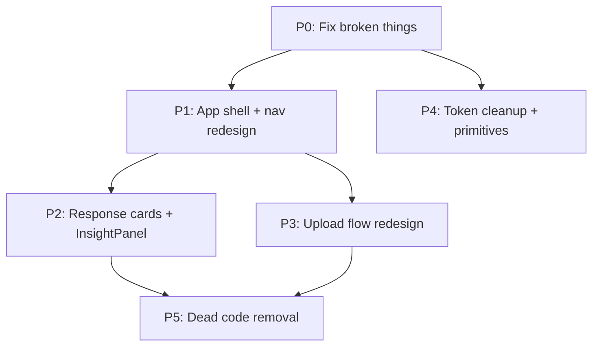

# GINA Frontend UI/UX Overhaul

## Part 1: Brutal Evaluation

### The `/app` page — "Welcome to G.I.N.A" (the screenshot you shared)

This is the first thing a user sees after login. It is a **dead end**.

- The main content area shows a clock icon, a serif heading, and a paragraph telling you to "Select a dataset and conversation from the sidebar." That is not a welcome experience — it is a **loading dock with instructions on where the loading dock is**.
- There is no CTA, no action, no upload prompt, no visual guidance. The user has to **already know** the sidebar exists and how the data model works (datasets contain conversations) before they can do anything.
- The icon (a clock) has no semantic connection to the product. Why a clock?
- On mobile (`< md`), the sidebar is `hidden` with **zero alternative navigation**. The page literally tells you to use something that does not exist on your screen.

### The Sidebar

- **Information architecture is wrong.** The sidebar conflates two unrelated concerns: "which data am I looking at" (datasets) and "which thread am I in" (conversations). These are nested (conversations live inside datasets), which forces a tree-style UI in a 280px column. The result: truncated dataset names, cramped conversation lists, and constant expanding/collapsing.
- **"New conversation" is buried.** It is a small text link nested inside an expanded dataset section. Starting a new question thread — the **primary action** in a chat app — requires: (1) having the right dataset expanded, (2) scrolling to find the button, (3) clicking it, (4) waiting for a `POST`, (5) navigating to the new URL. The page reloads and the user context resets. This is the "reloading again and again" you described.
- **Conversations have no useful titles.** They all say "New Conversation" because the backend generates a generic title. The kebab menu offers Rename and Delete, but **both are TODO stubs** — they toast success without calling any API.
- **"Notifications" button does nothing.** Dead control that trains users not to trust the UI.
- **"Settings" opens semantic corrections**, not settings. Mislabeled.
- **"PREMIUM ANALYST" badge** is hardcoded. The fallback email is `james@natwest.com`. The version string `VER: 2.4.0-STABLE` and the `IntegrationDebugPanel` are dev artifacts shown to all users.
- **Upload button** is styled as a dashed-border secondary action — it looks like a placeholder, not a primary entry point.

### The Chat Flow

- **Creating a new conversation causes a full route change** (`router.push`) + conversation provider refetch + message fetch. This is what produces the "reload" feel. There is no optimistic UI — you watch a spinner, then land on an empty chat.
- **The chat input has a paperclip button that does nothing.** Decorative controls erode trust.
- **Cmd/Enter does not work while typing** because `useKeyboardShortcuts` explicitly skips `INPUT` elements. The keyboard shortcut is advertised but broken for the exact scenario where you would use it.
- **Starter questions are hardcoded** ("Top Spend", "Time Series", "Outliers") regardless of which dataset is active. Asking about "top 5 categories by amount spent" on a dataset with no "amount" or "category" column will produce a confusing error.
- **Follow-up suggestions use `window.dispatchEvent`** (a global custom event) instead of a callback prop chain. This is fragile, untestable, and means any component anywhere could accidentally trigger a query.
- **The chat header only shows the dataset name.** No conversation title, no breadcrumb, no way to orient yourself within the app.

### The Output / Answer Cards

- **`OutputCard` is dense but decent in structure.** Key figure + narrative + chart + citations + SQL + follow-ups is a logical stack. But:
- **Confidence indicator has thumbs-up/thumbs-down buttons that do nothing.** More dead controls.
- **Charts are collapsed by default** behind "View Visualization." If a chart was generated, it should be visible — requiring a click to see the chart defeats the purpose of visual analytics.
- **Pin functionality is fully orphaned.** `ChartPanel` calls `setPinnedChart` on `UIStateProvider`, but `PinnedPanel` is **never rendered in any layout**. The pin button exists, the state updates, but nothing happens on screen.
- **`brand-teal` / `brand-teal-light` are used in 13+ files** (PipelineStep, ReasoningToggle, CorrectionModal, BigNumberCard, SQLExpand, DataTable, etc.) but **are not defined in tailwind.config.ts**. These classes silently generate no CSS. Affected elements may render with no color at all.
- **`ReasoningToggle` component is never imported anywhere** — dead code. The toggle behavior lives in `ThinkingPill` via the hook, but with a second instance creating potential desync.

### Upload Flow

- **Step 1** shows a drag-drop zone, a PII info box, and a disabled "Upload" button at the bottom. The disabled button is confusing — it suggests you need to do something else before uploading, but the actual action is clicking/dropping on the zone above. **Two contradictory affordances.**
- **Step 2** shows the PII summary but with a disabled "Processing" button — the user cannot cancel or go back to a different file during upload. They are trapped.
- **Step 3** shows an "Understanding Card" and then "Start asking questions" — but clicking that button **just closes the modal**. It does not navigate to the new dataset or create a conversation. The user lands back on whatever page they were on and has to manually find the new dataset in the sidebar.
- **The close button (X) disappears after step 1.** If the upload fails or the user changes their mind during steps 2-3, the only escape is the small "Cancel"/"Upload another" text links.

### Marketing Pages (landing, how-it-works, what-gina-provides, live-demo)

- These are generally well-designed and cohesive. The landing page hero, marquee, and CTAs are strong.
- **`how-it-works` has dead code:** `features`, `exampleQueries`, `activeQuery` state — all defined but never rendered.
- **Nav links** reference `/#how-it-works` and `/#features` anchors that **don't exist** on any page.
- **Footer is inconsistent** across pages (some have 3-column, others minimal).

### Cross-Cutting Technical Debt

- **Duplicate toast systems**: `ToastProvider` and `UIStateProvider` both render positioned toast-like elements in the bottom-right.
- **Hard-coded hex values** (`#0F121A`, `#10141D`, `#1C212E`, `#141822`, `#1C212E`, `#252B3A`, `#171B26`, `#232833`) alongside semantic tokens (`surface`, `surface-secondary`). Many of these are 1-2 shades different from the token values, creating subtle inconsistency.
- **No shared Button/Input/Card primitives.** Every component hand-rolls its own `px-6 py-2.5 bg-brand-indigo text-white rounded-lg text-sm font-semibold` strings. Inconsistencies in padding, radius, font weight are scattered everywhere.

---

## Part 2: The Overhaul Plan (Frontend-Only)

### Priority 0: Fix broken things

- **Add `brand.teal` and `brand.teal-light`** to `tailwind.config.ts` (map to `brand.cyan` values or define new ones). This is a one-line fix that unbreaks 13+ component files.
- **Remove the Notifications button** from the sidebar.
- **Remove the paperclip button** from ChatInput (or hide it).
- **Remove the thumbs-up/thumbs-down** from ConfidenceIndicator (or hide).
- **Fix `useKeyboardShortcuts`** to allow Cmd/Ctrl+Enter inside input fields (the one shortcut that matters).
- **Remove `IntegrationDebugPanel`** from the sidebar (move behind a dev-only flag).
- **Remove `VER: 2.4.0-STABLE`** from the sidebar footer.
- **Remove hardcoded fallback email** `james@natwest.com`.

Files: [`tailwind.config.ts`](frontend/tailwind.config.ts), [`Sidebar.tsx`](frontend/components/sidebar/Sidebar.tsx), [`ChatInput.tsx`](frontend/components/chat/ChatInput.tsx), [`ConfidenceIndicator.tsx`](frontend/components/output/ConfidenceIndicator.tsx), [`useKeyboardShortcuts.ts`](frontend/lib/hooks/useKeyboardShortcuts.ts)

### Priority 1: Redesign the App Shell and Navigation

**Goal:** Eliminate the dead `/app` welcome page, make dataset selection and conversation creation effortless, stop the reload loop.

**New layout concept:**

```
+----------------------------------------------------------+
| Dataset Switcher (dropdown)  |  [+ New Chat]  | [Upload] |
+----------------------------------------------------------+
| Conversation    |                                        |
| List            |   Chat Area                            |
| (left rail)     |   (messages + input)                   |
|                 |                                        |
| - conv 1        |                                        |
| - conv 2        |                                        |
| - conv 3        |                                        |
+----------------------------------------------------------+
```

**Changes:**

1. **Replace the current sidebar with a two-part layout:**
   - **Top bar** (full width): dataset switcher dropdown on the left, "New Chat" primary CTA in the center/right, "Upload Dataset" button on the right. Profile/sign-out in a minimal avatar dropdown far-right.
   - **Left rail** (~240px, collapsible): conversation list for the active dataset only. No tree nesting. Clean list of conversation titles with timestamps.

2. **`/app` default behavior:** When a user lands on `/app`, auto-select the first dataset and first conversation (or show the empty state with a prominent "Upload your first dataset" or "Start a new chat" CTA — not a paragraph of instructions).

3. **"New Chat" creates a conversation and navigates optimistically.** Show the empty chat state immediately with the input ready, create the conversation in the background. No spinner, no reload. The conversation appears in the left rail with an optimistic entry.

4. **Mobile:** The left rail becomes a bottom sheet or slide-over drawer triggered by a hamburger. The top bar collapses into a compact header with dataset name + hamburger.

5. **Remove the "PREMIUM ANALYST" badge, debug panel, version string** from the sidebar/rail.

Files: [`app/app/layout.tsx`](frontend/app/app/layout.tsx), [`app/app/page.tsx`](frontend/app/app/page.tsx), [`Sidebar.tsx`](frontend/components/sidebar/Sidebar.tsx) (rewrite as `TopBar` + `ConversationRail`), [`DatasetSection.tsx`](frontend/components/sidebar/DatasetSection.tsx) (replace with `DatasetSwitcher` dropdown), [`NewConversationBtn.tsx`](frontend/components/sidebar/NewConversationBtn.tsx), [`useConversation.tsx`](frontend/lib/hooks/useConversation.tsx)

### Priority 2: Response Cards + Right-Side Chart Panel (major)

This is the biggest single UX change. The current `OutputCard` jams everything into the chat column: key figure, narrative, chart (collapsed), citations, SQL, follow-ups. It makes the chat feel cluttered, and hides the visualization — the most valuable output — behind a click.

#### What the backend actually sends (from API + Architecture docs)

Every assistant message has an `outputPayload` with this shape:

```
OutputPayload {
  messageId, keyFigure, narrative, confidenceScore,
  chartType: 'big_number' | 'bar' | 'line' | 'grouped_bar' | 'stacked_bar' | 'table',
  chartData: StandardChartData { labels, datasets } | BigNumberChartData { label, value },
  citationChips: string[],
  sql, secondarySql, rowCount,
  followUpSuggestions: string[],
  autoInsights: string[],
  cacheHit, snapshotUsed
}
```

Key observations from real API responses:
- **Conversational replies** (e.g. "Hello, what can you do?") return `chartType: "table"`, `chartData: { labels: [], datasets: [] }`, `sql: ""`, `keyFigure: "—"`. This is "no real chart data" — we must detect this and show **no chart**.
- **Analytic replies** return real `chartType` (`bar`, `big_number`, `line`, etc.) with populated `chartData`, non-empty `sql`, and a meaningful `keyFigure` like `"£76.0M"`.
- **`autoInsights`** is an array of strings like `"Decreasing trend: 14.5M → 11.1M"` — currently never rendered in the UI.

#### Detection logic: "does this response have a real chart?"

A response has a displayable chart when ALL of:
1. `chartType` is not `'table'` (tables stay inline in the card as a data grid)
2. `chartData` is not empty:
   - For `StandardChartData`: `labels.length > 0 && datasets.length > 0`
   - For `BigNumberChartData`: `value !== undefined`
3. `sql` is non-empty (a query actually ran)

When `chartType === 'table'` with populated data, render a `DataTable` inline in the response card (tables are textual, not visual).

#### New layout: chat + right insight panel

```
+--------------------------------------------------+--------------------+
| TopBar (dataset switcher, new chat, upload, user) |                    |
+-------------------+------------------------------+--------------------+
| Conversation Rail | Chat Messages                | Insight Panel      |
| (left, ~220px)    | (center, flex-1)             | (right, ~400px)    |
|                   |                              |                    |
|                   | [user msg]                   | Chart title        |
|                   | [assistant card: text only]  | [rendered chart]   |
|                   | [user msg]                   |                    |
|                   | [assistant card: text only]  | [Pin] [Unpin]      |
|                   |                              |                    |
|                   | [---chat input---]           | "From: question..."| 
+-------------------+------------------------------+--------------------+
```

- **The right panel (`InsightPanel`) only exists when there is at least one chart in the conversation.**
- When it does not exist, chat area gets the full width (`flex-1`).
- When it appears, it slides in with a smooth transition (`translate-x` animation), taking ~400px.
- The layout uses `flex` with conditional rendering — no panel, no width consumed.

#### InsightPanel behavior

1. **Auto-show most recent chart.** When the pipeline returns a response with a real chart, `InsightPanel` slides open showing that chart. The panel title shows the question that generated it.
2. **Clickable chart indicators in response cards.** Each response card that has chart data shows a small "View chart" chip/icon. Clicking it loads that card's chart into the `InsightPanel` (replaces current chart).
3. **Pin for session.** A pin button on the panel locks the current chart. While pinned, new charts do NOT auto-replace it — the user can keep asking questions while staring at a chart. A small indicator shows "new chart available" that they can click to switch. Unpinning reverts to auto-show-latest behavior.
4. **Close panel.** An X on the panel closes it entirely (clears the chart state). It reopens when the next chart arrives.

#### InsightPanel state (in `UIStateProvider`)

Extend `UIStateProvider` to manage:

```typescript
interface InsightPanelState {
  activeChart: { type: ChartType; data: ChartData; question: string; messageId: string } | null;
  pinnedChart: { type: ChartType; data: ChartData; question: string; messageId: string } | null;
  isPanelOpen: boolean;
}
```

- `activeChart`: the chart currently displayed (most recent, or user-selected from a card)
- `pinnedChart`: if set, the panel shows this instead of `activeChart`, and new charts queue silently
- `isPanelOpen`: controls visibility; auto-set to `true` when `activeChart` becomes non-null

#### Redesigned OutputCard (in chat messages)

The response card becomes a **clean text-focused block** without any inline chart rendering:

```
┌─────────────────────────────────────────────────┐
│  £76.0M                          Confidence: 90%│  ← KeyFigure + ConfidenceIndicator (no thumbs)
│                                                 │
│  Your largest expense categories are Technology,│  ← NarrativeText
│  Healthcare, and Education...                   │
│                                                 │
│  ▸ Decreasing trend: 14.5M → 11.1M             │  ← AutoInsights (NEW — currently unsurfaced)
│                                                 │
│  📊 View chart  ·  category, total_expense      │  ← Chart chip (opens InsightPanel) + Citations
│                                                 │
│  ▸ See how this was calculated (6 rows)         │  ← SQLExpand (collapsed)
│                                                 │
│  Suggested: "How has spending changed MoM?"     │  ← FollowUpSuggestions
│  "Which category has the highest spend?"        │
│  "Something off?" (if non-demo)                 │
└─────────────────────────────────────────────────┘
```

For conversational replies (no chart, no SQL, keyFigure is "—"):

```
┌─────────────────────────────────────────────────┐
│  I can help you analyze data from the given     │  ← NarrativeText only
│  dataset...                                     │
│                                                 │
│  Suggested: "How has spending changed MoM?"     │  ← FollowUpSuggestions
└─────────────────────────────────────────────────┘
```

Key changes vs current `OutputCard`:
- **Charts removed from card** — they live in `InsightPanel` now
- **AutoInsights rendered** — each string as a styled pill/chip (new, never shown before)
- **"View chart" chip** replaces inline `ChartPanel` — clicking it pushes chart to `InsightPanel`
- **KeyFigure hidden when "—"** (conversational responses)
- **ConfidenceIndicator without thumbs** (dead controls removed)
- **CitationChips shown only when non-empty**
- **SQLExpand shown only when `sql` is non-empty**
- **SomethingOff shown only for non-demo datasets** (already correct)
- **`big_number` rendered inline** in the card as a prominent stat (not in InsightPanel — it's textual, not a chart). Only multi-point charts (`bar`, `line`, `grouped_bar`, `stacked_bar`) go to the panel.
- **`table` type rendered inline** via `DataTable` when `chartData` has rows.

#### Other chat experience fixes (still in P2)

1. **Remove the global `window.dispatchEvent` pattern** for follow-up suggestions. Pass a callback through props: `OutputCard` → `FollowUpSuggestions` → `onFollowUp(question)` → `ChatView.handleSubmit`.
2. **Fix the double-scroll issue**: `ChatView` has `overflow-y-auto` on the main area div, and `MessageList` also has `overflow-y-auto`. Remove scrolling from `MessageList`, let the parent handle it.
3. **Add conversation title to the chat header** alongside the dataset name.
4. **Relabel "Settings"** to "Semantic Corrections" or remove from rail — it belongs in the dataset switcher dropdown.

Files: [`OutputCard.tsx`](frontend/components/output/OutputCard.tsx) (major rewrite), [`ChartPanel.tsx`](frontend/components/output/ChartPanel.tsx) (rewrite as `InsightPanel`), [`UIStateProvider.tsx`](frontend/lib/providers/UIStateProvider.tsx) (extend state), [`app/app/layout.tsx`](frontend/app/app/layout.tsx) (add InsightPanel slot), [`ChatView.tsx`](frontend/components/chat/ChatView.tsx) (wire new chart flow + fix scroll + remove window events), [`ConfidenceIndicator.tsx`](frontend/components/output/ConfidenceIndicator.tsx) (remove thumbs), [`FollowUpSuggestions.tsx`](frontend/components/output/FollowUpSuggestions.tsx) (callback prop), [`MessageList.tsx`](frontend/components/chat/MessageList.tsx) (fix scroll), new file `InsightPanel.tsx`

### Priority 3: Redesign the Upload Flow

1. **After upload completes (step 3), "Start asking questions" should:**
   - Set the newly uploaded dataset as active
   - Create a new conversation for it
   - Navigate to `/app/[newConversationId]`
   - The user lands directly in a chat ready to ask questions
2. **Keep the X close button visible on all steps** (not just step 1).
3. **On step 2 (processing), show a progress indicator** instead of a dead disabled button. If it fails, offer retry.
4. **Remove the disabled "Upload" button on step 1.** The drop zone is the action. The footer should just have "Cancel."

Files: [`UploadModal.tsx`](frontend/components/upload/UploadModal.tsx)

### Priority 4: Design Token Cleanup and Component Primitives

1. **Audit and replace all raw hex values** with the semantic `surface-*` and `brand-*` tokens. Create additional tokens if needed (e.g. `surface-elevated` for `#141822`).
2. **Create shared primitives** in a new `components/ui/` directory:
   - `Button.tsx` (variants: primary, secondary, ghost, danger; sizes: sm, md, lg)
   - `Input.tsx` (text input with consistent focus ring)
   - `Card.tsx` (panel wrapper with consistent border/bg/radius)
   - `Modal.tsx` (backdrop + focus trap + escape handling + consistent close button)
   - `Dropdown.tsx` (for dataset switcher, profile menu)
3. **Migrate existing components** to use these primitives instead of hand-rolled class strings.

Files: New `frontend/components/ui/` directory; then update all existing components.

### Priority 5: Dead Code Removal

- Delete `ReasoningToggle.tsx` (unused component — never imported)
- Delete `PinnedPanel.tsx` and `PinnedOutputPanel.tsx` (replaced by `InsightPanel`)
- Delete old `ChartPanel.tsx` (replaced by `InsightPanel` + inline rendering)
- Remove dead variables from `how-it-works/page.tsx` (`features`, `exampleQueries`, `activeQuery`)
- Remove broken nav anchor links (`/#how-it-works`, `/#features`)
- Consolidate the duplicate toast in `UIStateProvider` into `ToastProvider` (UIStateProvider should use `useToast()` instead of its own toast div)
- Remove unused imports across all files (`BrainCircuit`, `ShieldCheck`, `Database` in ChatInput, `Sparkles` in UploadModal if unused)

Files: Various (list above)

### Mentioned but deferred (needs backend)

- Conversation rename API (currently TODO stub)
- Conversation delete API (currently TODO stub)
- Auto-generating conversation titles from the first question (backend could return a title with the first response)
- Dataset-aware starter questions (backend could return suggested questions per dataset)
- Feedback/thumbs-up-down API (currently decorative)

---

## Implementation Order

The plan is ordered so each priority builds on the last and the app remains functional throughout:

1. **P0** first (bug fixes, dead control removal) — small, safe, immediately improves trust
2. **P1** next (app shell + nav redesign) — biggest UX impact, changes the layout mental model. This also sets up the 3-column layout that P2 depends on.
3. **P2** after P1 (response card overhaul + InsightPanel) — the centerpiece UX improvement. Depends on P1 because InsightPanel is a new column in the app layout.
4. **P3** after P1 (upload flow) — can be done in parallel with P2
5. **P4** throughout — token cleanup and primitives can be woven in as we touch files
6. **P5** at the end — cleanup pass once features are stable

### Dependency graph


